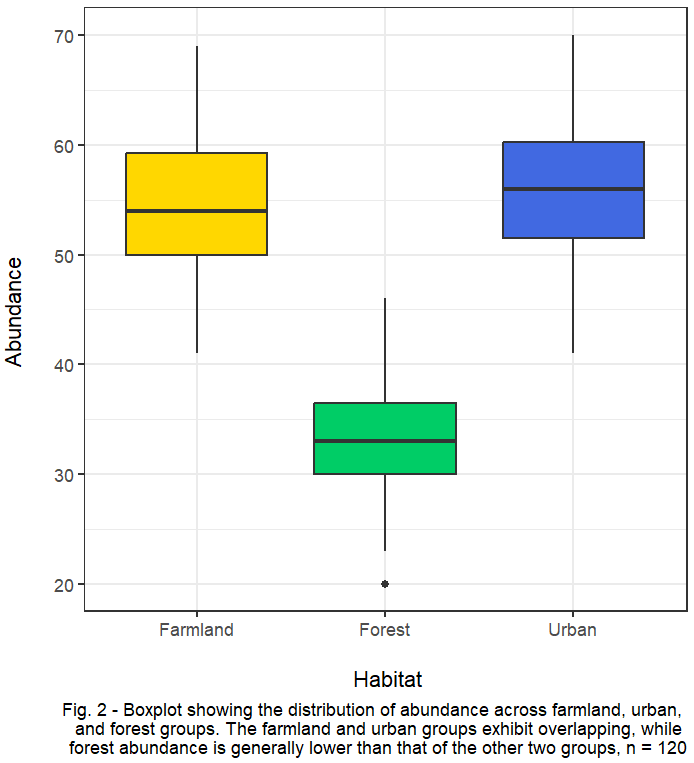
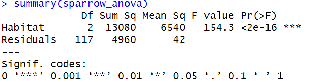
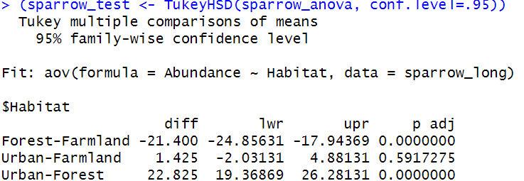
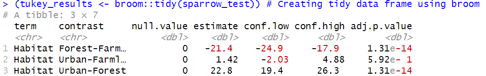
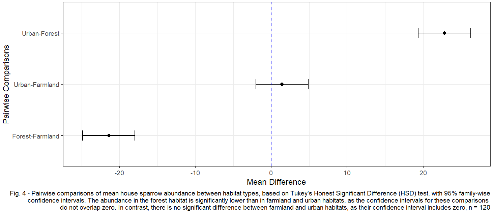

<center></center>

<sub>Image: https://www.pexels.com/photo/sparrows-sitting-on-windowsill-14749635/ & https://ourcodingclub.github.io/</sub>

*Created by Abigail Haining (28/11/24)* 

---

This tutorial is a part 2 to the <a href="https://ourcodingclub.github.io/tutorials/anova/">ANOVA from A to (XY)Z</a> tutorial. In this continuation, we will recap how to conduct a one-way ANOVA using a different dataset and delve deeper into analysing our ANOVA results by performing a post-hoc test. Specifically, we will explore Tukey's test as the post-hoc method for further analysis.

Often in ecological and environmental research you will need to compare groups of data to see if there is a difference between the groups. This could be comparing plant growth between different soil types or water quality in different rivers for example. In this tutorial we will look at the difference in house sparrow (*Passer domesticus*) abundance between different habitats.

__In this tutorial you will learn how to:__
- Load and prepare data for analysis in RStudio
- Understand when to use/the purpose of a one-way ANOVA and Tukey's test
- Perform a one-way ANOVA and Tukey's test
- Interpret the outputs from these tests
- Recognise assumptions of these tests
- Visualise the data and outputs
- Report findings

<mark> Please Note: This tutorial assumes a basic understanding on how to use RStudio and produce plots. </mark>

> You can get all of the resources for this tutorial from <a href="https://github.com/EdDataScienceEES/tutorial-Abigail-Louise.git" target="_blank">this GitHub repository</a>. Clone and download the repo as a zip file, then unzip it.

---

### Tutorial Steps:

#### <a href="#section1"> 1) What is ANOVA and Tukey's Test?</a>

#### <a href="#section2"> 2) Research question and hypothesis</a>

#### <a href="#section3"> 3) Data manipulation</a>

#### <a href="#section4"> 4) Data visualisation</a>

#### <a href="#section5"> 5) Running a one-way ANOVA</a>

#### <a href="#section6"> 6) Running Tukey's HSD</a>

#### <a href="#section7"> 7) Communicating model results</a>

---

<a name="section1"></a>

## 1) What is ANOVA and Tukey's Test?

__ANOVA:__

An ANOVA which stands for "ANalysis Of VAriance" is a statistical method used to compare the means across three or more independent groups. It considers the variability both within each group and between them to determine statistical significance.

Refer to part 1 - <a href="https://ourcodingclub.github.io/tutorials/anova/">ANOVA from A to (XY)Z</a> for a more in depth explaination of ANOVA and choosing the appropriate test for your data.

__Why should you carry out a post-hoc test?__

If the overall p-value from the ANOVA is less than the significannce level you have specified then we can say at least one of the means of the groups is different from the others. However, this does not tell us which groups differ from each other. This is where a post hoc test comes in to test which groups are different from each other. 

__Tukey's test:__

One of the most commonly used post-hoc tests is Tukey's HSD test, which stands for "Tukey's Honest Significant Difference" test. It makes pairwise comparisons between the means of each group - this means it compares every possible pair of group means to determine if there is a statistically significant difference between them. 

You have probably heard of Type I (false positive) and Type II (false negative) errors before. Well, Tukey's test controls for Type I errors by controlling the family-wise error rate which is the probability of making at least one Type 1 error when performing multiple statistical tests.

Other strengths of Tukey's test include ease of interpretation and a good balance of statistical power which is the ability to detect true differences and control of Type I errors which is why this post-hoc has been chosen for this introductory tutorial. It is also important to be aware of its limitations though, which include the assumption of equal variances across all groups and a normal distribution of residuals (as required by ANOVA), it is restricted to pairwise tests and sample sizes must be approximately equal. If the assumptions of the Tukey's test are met it should produce valid outputs and if your data does not meet them there are many others post-hoc tests out there. 

__Examples of other post-hoc tests:__
- Games-Howell test can handle unequal variances and sample sizes between groups
- Dunn's test is a non-parametric test which can be used for data that is not normally distibuted
- Scheffé's test is more flexible and can be used for non-pairwise comparisons

---

<a name="section2"></a>

## 2. Research question and hypothesis

Before you begin doing any statistical analysis it is important to set a __research question__. A research question is a specific question that guides a research project. It serves as a foundation for the research design and influences what data collection and analysis you will carry out. Our research question for this tutorial is:

#### How does house sparrow (*Passer domesticus*) abundance differ between habitats?

<center></center>

<sub>Image: https://www.pexels.com/photo/house-sparrow-on-a-tree-branch-in-spring-nature-29423562/</sub>

The house sparrow (*Passer domesticus*) is one of the most widespread bird species globally and is known for their close association with human-modified environments. Despite their adaptability, monitoring suggests a severe decline of 71% between 1977 and 2008 in the UK (RSPB, n.d.). 

Understanding how the house sparrow abundance varies between different habitats can provide insights into the ecological requirements and threats this species faces. This research can identify areas where the house sparrow abundance is low to inform conservation efforts. Let's say the habitat types you would like to compare are __urban, farmland__ and __forest__. 

After deciding on a research question you should think about what you expect to see from your research and why, which will form your __hypothesis__.

A hypothesis is a formal, testable statement about the expected relationship between variables or conditions. It represents your initial educated guess about the outcome of the research based on prior knowledge. 

For example you may think urban areas will have higher house sparrow abundance due to the availability of food from human activity, such as discarded scraps and bird feeders in gardens. Therefore, your hypothesis could be:

<a name="hypotheses"></a>

#### There will be a higher abundance of the house sparrow (*Passer domesticus*) in urban habitats compared to farmland and forests.

You can make serveral hypotheses, as you may also want make a distinction between the farmland and forests habitat. You may assume house sparrows would prefer farmland over forests due to the their dietary preference of seeds and grains, which are more abundant in agricultural areas. There may also be less competition for resources in farmland compared to forests, which have a greater number of species using the same resources. Therefore, a second hypothesis could be:

#### There will be a higher abundance of house sparrow (*Passer domesticus*) in farmland habitats compared to forests.

Imagine you have determined your data collection method and conducted fieldwork to gather data on the abundance of house sparrows across the three habitats at multiple sites. You are now ready to start analysing the data!

---

<a name="section3"></a>

## 3) Data manipulation

We will begin coding by opening `RStudio` and creating a new script by clicking on `File/ New File/ R Script` 

It is good practice to start your script by giving it a __title__, stating __who__ it was written by with __contact details__ and the __date__. 

```r
# ANOVA and Tukey's HSD Tutorial full script
# Written by Abigail Haining
# Email - s2317501@ed.ac.uk
# 19/11/24
```

You can also add a __workflow__ which is a list of the main sections of your script to make it easier to navigate.

```r
# Workflow:
# 1) Set working directory, load packages and import data
# 2) Data manipulation
# 3) Data visualisation
# 4) Running a one-way ANOVA
# 5) Running Tukey's HSD
# 6) Communicating model results
```

Next, we will set the working directory and load required packages. The packages we will load are 
- `tidyverse`: This package includes many helpful packages for data manipulation and data visualisation, such as  `dplyr`, `tidyr`and`ggplot2`.
- `broom`: For tidying model outputs
- `grid`: For customising detailed visualisations and improving layouts
- `gridExtra`: For combining multiple plots into one figure and arranging figures


```r
# Set the working directory (enter your own filepath here)
setwd("C:/Users/abiga/OneDrive/3rd year/Data Science in EES/tutorial-Abigail-Louise")

# You can check where your working directory is using:
getwd()

# Load packages
library(tidyverse)
library(broom)
library(grid)
library(gridExtra)
```

This tutorial uses a dummy dataset which is already relatively "clean". If you are using this tutorial to analyse your own dataset which is more complex and requires more data manipulation see these tutorials on <a href="https://ourcodingclub.github.io/tutorials/data-manip-intro/">basic data manipulation</a>, <a href="https://ourcodingclub.github.io/tutorials/data-manip-efficient/">efficient data manipulation</a> and <a href="https://ourcodingclub.github.io/tutorials/data-manip-creative-dplyr/">advanced data manipulation</a>.

Next, we need to import our data which can be done by directly typing the code below into your script. Or you can click `Files/ data/ house_sparrow.csv/ Import Dataset` then click the `Import` button in the bottom right of the window. You will notice this code will be entered into the console so if you would like to save it, copy and paste the code into your script. 

```r
# Import data
sparrow <- read_csv("data/house_sparrow.csv")
```

We can check the first 6 rows of data and the column headers in the console by using the `head()` function. Or to see the whole dataset in the top left window you can use the `view()` function.

```r
# Check the data
head(sparrow)
view(sparrow)
```

R requires data to be in long format for data analysis, where the dataset is arranged with each row representing an oberservation and each column representing a variable. We can do this using the `pivot_longer()` function, where `sparrow` refers to the data frame; `cols = c(Urban, Forest, Farmland)` refers to the columns we want to gather into a single column; `names_to = "Habitat"` refers to the name of the new column we are creating; and `values_to = "Abundance"` refers to the name of next new column which stores the values of the new gathered column.

```r
# Convert data frame to long form
sparrow_long <- pivot_longer(sparrow, cols = c(Urban, Forest, Farmland), names_to = "Habitat", values_to = "Abundance")
```
---

<a name="section4"></a>

## 4) Data visualisation

It is important to visualise your data __before__ undertaking any data analysis. 

ANOVA is a parametric test which means it replies on assumptions about the parameters of the population from which the sample is derived. 

These assumptions are:
- The data are drawn from a population with a __normal distribution__
- There is __equal variances__ (homogeneity) across groups
- The data are measured on an __interval or ratio scale__ (continuous or numerical)

First, we will check there is a normal distribution of the response variable (abundance) by plotting a __histogram__ of the frequency distribution.

<mark> Please note: If your data does not have a normal distribution the data can be log-transformed or you could use a non-parametric test, such as Mann-Whitney U test or Kruskal-Wallis test. </mark>

```r
# Visualising data with histograms to check for normal distribution for each habitat type
# Urban
(sparrow_urban <- ggplot(sparrow, aes(x = Urban)) + # Creating plot, specifying data and the column to use for x axis
   geom_histogram(bins = 15,                        # Adding data as histogram with 15 intervals
                  fill = "royalblue") +             # Adding colour responding to habitat
   labs(x = "Abundance", y = "Frequency") +         # Adding x and y axis labels
   theme_test())                                    # Apply a clean theme

# Farmland
(sparrow_farmland <- ggplot(sparrow, aes(x = Farmland)) + # Creating plot, specifying data and the column to use for x axis
    geom_histogram(bins = 15,                             # Adding data as histogram with 15 intervals
                   fill = "gold") +                       # Adding colour responding to habitat
    labs(x = "Abundance", y = "Frequency") +              # Adding x and y axis labels
    theme_test())                                         # Apply a clean theme

# Forest
(sparrow_forest <- ggplot(sparrow, aes(x = Forest)) + # Creating plot, specifying data and the column to use for x axis
    geom_histogram(bins = 15,                         # Adding data as histogram with 15 intervals
                   fill = "springgreen3") +           # Adding colour responding to habitat
    labs(x = "Abundance", y = "Frequency") +          # Adding x and y axis labels
    theme_test())                                     # Apply a clean theme
```

<mark> Tip: By putting the whole code for a plot in brackets () the plot will appear in your bottom right window without you having to call them! </mark>

To view all three plots at once we can add them to a single panel using the `grid.arrange ()` function from the `gridExtra` package:

```r
# Arranging plots in a single panel
(grid.arrange(sparrow_urban, sparrow_farmland, sparrow_forest, nrow = 1,        # Creating panel of 3 plots on 1 row
             bottom = textGrob("Fig. 1 - Response variable (Abundance) appears normally distributed across all groups (Habitats), n = 120", # Adding caption
                               gp = gpar(fontsize = 10, fontface = "italic")))) # Specifying font size for caption and making it italic

```

<center></center>

These histograms all have a relatively normal distribution which is what we want to continue analysing our data with ANOVA.

Let's also visualise our data with a box plot to look at the variation across our continuous response variable (abundance) across our groups (habitats).

```r
# Visualising data with a boxplot
(sparrow_boxplot <- ggplot(sparrow_long,                                      
                           aes(x = Habitat, y = Abundance, fill = Habitat)) +                   # Setting x axis as habitat and y as abundance 
   geom_boxplot() +                                                                             # Adding data as a boxplot
   scale_fill_manual(values = c("gold", "springgreen3", "royalblue")) +                         # Setting box colours to corresponding habitat colours
    labs(x = "\n Habitat", y = "Abundance \n",                                                  # Adding axis labels (\n leaves a space between plot and title) 
      caption = "Fig. 2 - Boxplot showing the distribution of abundance across farmland, urban, 
      and forest groups. The farmland and urban groups exhibit overlapping, while 
      forest abundance is generally lower than that of the other two groups, n = 120") +        # Adding caption
   theme_bw() +                                                                                 # Apply a clean theme
   theme(legend.position = "none"))                                                             # Removing legend

```

<center></center>

<mark> Tip: Remove legends if they are unnecessary! </mark>

When interpretating a boxplot you are looking to see if the boxes __overlap__ as you probably have a significant difference between these groups if they do. This is due to the box encompassing half of each groups values! Looking at our boxplot, the urban and farmland boxes overlap which could mean there is no significant difference between them. The forest box does not overlap with either of the other habitats which could mean a significant difference. However, you must confirm this by doing __statistical analysis!__

---

<a name="section5"></a>

## 5) Running a one-way ANOVA

We will start our statistical analysis with running the __ANOVA!__

We will assign the result of the ANOVA to a variable called `sparrow_anova` and use the ANOVA function (`aov()`). Within the brackets, the response variable is a function `~` of the explanatory variable, then specify your data (`data = sparrow_long`).

To see your ANOVA results you must print the `summary()`:

```r
# Running a one-way ANOVA of abundance against habitat
sparrow_anova <- aov(Abundance ~ Habitat, data = sparrow_long)

# Printing summary output
summary(sparrow_anova)
```

Output in console:
<center></center>

Now, let's interpret our ANOVA table results! 

Each column will have a value for the model and the residuals. The residuals are the differences between the observed values and the values predicted by the model.

__What each column means:__
- The degrees of freedom (`Df`): For the model, this represents the number of parameters estimated in the model excluding the intercept (number of groups - 1). For the residuals, this represents the remaining unexplained variation (total number of observations - number of groups).
- The sum of the squares (`Sum Sq): For the model

Our significance level for this tutorial is 0.05. Why? 

This is widely adopted standard in statistics which represents the threshold for deciding significance. The significance level is the probability of making a type I error (false positive), so at 0.05 there is a 5% risk of concluding that there is an effect/difference when there is none. 


__Checking assumptions:__

We can check for a normal distribution of residuals by plotting a histogram of the residuals and a normal Q-Q plot.


```r
hist(sparrow_anova$residuals, breaks = 30)  # Plotting histogram of residuals and increasing intervals to get a better visualisation
# The residuals do not look normally distributed
```

<center></center>

```r
plot(sparrow_anova, which = 2) # Plotting Q-Q plot
# There are heavy tails present which suggests the data has a skewed distribution 
# Or the outliers do not follow a normal distribution (by looking at the histogram it appears to be the this)
```

<center></center>

```r
# Checking for homoscedasticity
plot(sparrow_anova, which = 1)
# The red line is flat against grey dashed line which is what we want to see
```

<center></center>

From these results we may think our <a href="hypotheses">hypotheses</a> are true. However, 

---

<a name="section6"></a>

## 6) Running Tukey's HSD

Let's perform Tukey's test using the `TukeyHSD()` function!

We will set our confidence intervals to 95% as this is directly tied to the significance level (calculated by 1 - 0.05).

```r
# Running Tukey's HSD post-hoc test on the anova output and setting the confidence level to 95%
(sparrow_test <- TukeyHSD(sparrow_anova, conf.level=.95))
```
Output in console:
<center></center>

__What each column means:__
- The group comparisons (`$Habitat`): The names of the two groups being compared
- Difference (`diff`): The difference between the means of the two groups - positive values indicating that the first group has a higher mean than the second, while negative values indicate the opposite
- Lower confidence interval (`lwr` and `upr`): The lower and upper bounds of the confidence interval for the difference in means - if the interval includes 0, there is no significant difference between the groups
- Adjusted p-value (`p adj`): The p-value for each comparison adjusted for multiple testing using Tukey's method -a p-value less than your specified threshold indicates a statistically significant difference between the groups

<mark> Tip: To convert results into a better presented format of the summary table you can use the broom package: </mark>

```r
(tukey_results <- broom::tidy(sparrow_test)) # Creating tidy data frame using broom
```

Output in console:
<center></center>

We can see from the p-values (if our significance level is 0.05), the forest and farmland habitats show a significant differences in abundance as the p-value is less than 0.05, and so do the urban and forest habitats. However, the urban and farmland habitats have a p-value more than 0.05 so they do not appear to be significantly different. 

If you find the tables quite confusing, another way to interpret the results is by plotting them:
```r
# Plotting Tukey's test result
plot(sparrow_test)
```

<center></center>

To read this plot you are looking to see if the confidence intervals cross over the zero line. If they cross zero this __is not__ statistically significant and if they do not this __is__ statistically significant.

The comparison of mean values between the urban and farmland groups shows that the confidence interval includes zero, indicating no statistically significant difference in abundances between these groups. In contrast, the confidence intervals for the other two group comparisons do not include zero, indicating statistically significant differences. These results are consistent with to our corresponding p-values.

---

<a name="section7"></a>

## 7) Communicating model results

```r
# Creating summary table of key statistics 
sparrow_summary <- sparrow_long %>%
  group_by(Habitat) %>%                          # Grouping the abundance data by habitat
  summarise(n = n(),                             # "n" is the number of observations
            average_abundance = mean(Abundance), # Average abundance of each habitat
            SD = sd(Abundance)) %>%              # Standard deviation of abundance in each habitat
  mutate(SE = SD/sqrt(n))
```


```r
# Creating bar plot of sparrow summary
(sparrow_barplot <- ggplot(data = sparrow_summary) +
    geom_bar(aes(x = Habitat, y = average_abundance, fill = Habitat),    # Creating bar plot with habitat on the x axis and average abundance on the y
             stat = "identity", colour = "black") +                      # Setting stat to identity uses average_abundance instead of count and adding black borders to bars
    geom_errorbar(aes(x = Habitat, ymin = average_abundance - SE,        # Adding error bars to represent standard error
                      ymax = average_abundance + SE), width = 0.25,      # Setting width of the error bars to 0.25 for better visibility
                  colour = "black", linewidth = 0.6) +                   # Setting colour and thickness of error bars
    scale_fill_manual(values = c("gold", "springgreen3", "royalblue")) + # Setting bar colours to colourblind friendly colours
    labs(x = "\n Habitat", y = "Average Abundance \n",                   # Adding axis titles 
         caption = "Fig. 3 - Average abundance of house sparrows across the three habitats with error bars representing 
         standard error. The overlap of error bars between farmland and urban suggests no significant difference 
         between these two habitats, while the forest habitat shows a significantly lower abundance, n = 120") + # Adding caption            
    theme_test() +                                                       # Apply a clean theme
    theme(legend.position = "none"))                                     # Removing legend
```

For any plots you want to put in a report include an __informative figure caption__. It is more professional to use captions placed under figures instead of titles.

The caption should have:
- A figure number (`Fig. 1`)
- A brief description of the content, such as variables or comparisons being made
- The methods necessary to understand the figure
- A summary of the major findings
- The statistical information, such as the sample size, statistical test used and what your error bars mean

<center></center>

```r
# Improve Tukey's test result plot
(sparrow_tukey_plot <- ggplot(tukey_results, 
                              aes(x = contrast, y = estimate)) +    # Set x axis to pairwise comparisons and y to mean differences
  geom_point(color = "black", size = 2) +                           # Add points for mean differences and increase size
  geom_errorbar(aes(ymin = conf.low, ymax = conf.high),             # Add error bars showing confidence intervals
                width = 0.2, color = "black") +                     # Add error bars for confidence intervals
  geom_hline(yintercept = 0, linetype = "dashed", color = "blue") + # Add a reference line at 0 and highlight with blue colour
  coord_flip() +                                                    # Flip coordinates for horizontal orientation
  labs(x = "Pairwise Comparisons", y = "Mean Difference",           # Add informative axis titles
       title = "Tukey HSD Test with 95% confidence level") +        # Add plot title
  theme_bw(base_size = 12))                                         # Apply a clean theme
```

<center></center>

To save your plots as images:
```r
# Saving a figure
ggsave(sparrow_tukey_plot, file = "plots/tukey_test_plot.png", # Replace with your own filepath and file name 
       width = 12, height = 6)                                 # Specifying width and height
```


---

__Well done__ for making through this tutorial! You should now know how to further analyse your ANOVA results by conducting Tukey's HSD post-hoc test.

__After completion this tutorial you should be able to:__
- Load and prepare data for analysis in RStudio
- Understand when to use/the purpose of a one-way ANOVA and Tukey's test
- Perform a one-way ANOVA and Tukey's test
- Interpret the outputs from these tests
- Recognise assumptions of these tests
- Visualise the data and outputs
- Report findings


<hr>

__Reference:__ RSPB (n.d.). www.rspb.org.uk. Available at: https://www.rspb.org.uk/birds-and-wildlife/house-sparrow. (accessed 26/11/24)

#### Useful links:
- Two articles from Statology: <a href="https://www.statology.org/one-way-anova/" target="_blank">One-way ANOVA: Definition, formula and example</a> and <a href="https://www.statology.org/tukey-test-r/" target="_blank">How to perform Tukey's test in R</a>
- Check out our <a href="https://ourcodingclub.github.io/links/" target="_blank">Useful links</a> page where you can find loads of guides and cheatsheets.

#### If you have any questions about completing this tutorial, please contact us on ourcodingclub@gmail.com

#### Stay up to date and learn about our newest resources by following us on <a href="https://twitter.com/our_codingclub" target="_blank">Twitter</a>.

### &nbsp;&nbsp;Subscribe to our mailing list:
<div class="container">
	<div class="block">
        <!-- subscribe form start -->
		<div class="form-group">
			<form action="https://getsimpleform.com/messages?form_api_token=de1ba2f2f947822946fb6e835437ec78" method="post">
			<div class="form-group">
				<input type='text' class="form-control" name='Email' placeholder="Email" required/>
			</div>
			<div>
                        	<button class="btn btn-default" type='submit'>Subscribe</button>
                    	</div>
                	</form>
		</div>
	</div>
</div>
